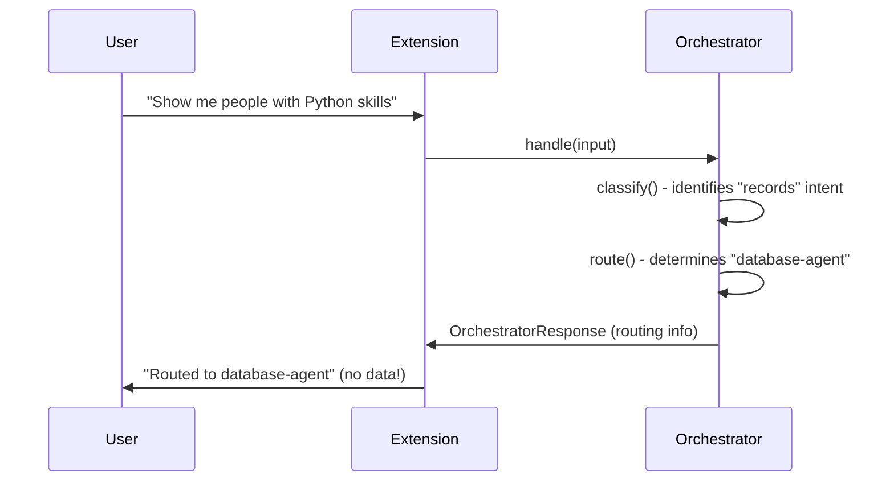
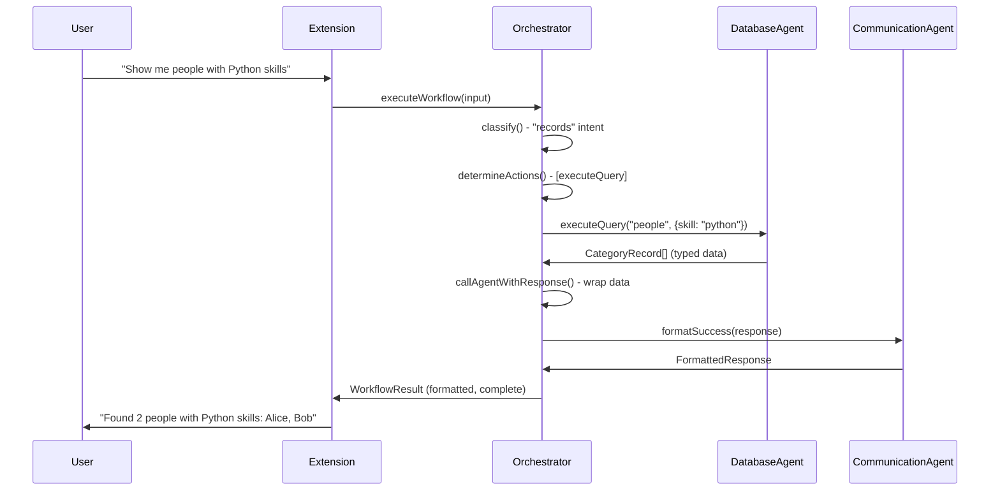

# Orchestrator Workflow Coordination Analysis

**Date**: 2025-11-10  
**Issue**: Orchestrator is a router, not a coordinator  
**Impact**: Critical - agents are never actually called, users get routing info instead of data

---

## Current State (BROKEN)

### What Happens Now



### Code Evidence

**Extension (`src/extension/index.ts:184-202`)**:

```typescript
const response = await orchestrator.handle({
  question: request.prompt,
  topic: "general",
});

stream.markdown(`${response.markdown}\n\n`);
stream.markdown(`**Summary:** ${response.summary}\n\n`);
stream.markdown(`**Rationale:** ${response.rationale}\n\n`);
stream.markdown(`*Agent Used: ${response.agent}*\n`);
```

**Orchestrator (`src/agent/orchestrator/index.ts:404-421`)**:

```typescript
async handle(input: OrchestratorInput): Promise<OrchestratorResponse> {
  try {
    const response = await this.route(input);  // ❌ Just routing, no execution
    return {
      ...response,
      markdown: this.formatResponseForUser(response, input),
    };
  } catch (error) {
    // Error handling
  }
}
```

**Orchestrator.route() (`src/agent/orchestrator/index.ts:291-313`)**:

```typescript
async route(input: OrchestratorInput): Promise<OrchestratorResponse> {
  const classification = this.classify(input);
  const agent = this.intentAgentMap[classification.intent] || this._getFallbackAgent();
  const summary = this.generateSummary(classification, input);
  const payload = this.generatePayload(classification, input);

  return {
    intent: classification.intent,
    agent,                    // ❌ String ID, not executed
    summary,                  // ❌ Guidance, not actual data
    rationale: classification.rationale,
    payload,                  // ❌ Intent payload, not agent results
    markdown: `...`,          // ❌ Routing info, not formatted data
  };
}
```

### Problems

1. **❌ No Agent Execution**: Agents are identified by ID but never instantiated or called
2. **❌ No Data Returned**: Users get routing guidance instead of actual query results
3. **❌ No Response Building**: callAgentWithResponse() exists but is never used
4. **❌ No Workflow State**: No tracking of "pending" vs "in-progress" vs "completed"
5. **❌ No Multi-Step Support**: Can't handle "fetch data, then analyze it"
6. **❌ No Continuation**: Every request starts from scratch
7. **❌ No Agent Instances**: No way to actually call DatabaseAgent.executeQuery()

---

## Required State (CORRECT)

### What Should Happen



### Required Architecture

#### 1. Workflow State Machine

```typescript
type WorkflowState =
  | "pending" // Not started
  | "classifying" // Analyzing intent
  | "executing" // Calling agent(s)
  | "processing" // Building response
  | "needs-clarification" // Missing info
  | "completed" // Ready to return
  | "failed"; // Error occurred

interface WorkflowContext {
  state: WorkflowState;
  currentAction: WorkflowAction | null;
  completedActions: WorkflowAction[];
  pendingActions: WorkflowAction[];
  results: Map<string, unknown>;
  errors: Error[];
}
```

#### 2. Action Definitions

```typescript
interface WorkflowAction {
  id: string;
  type: "classify" | "execute-agent" | "format" | "clarify";
  agent?: string;
  method?: string;
  params?: unknown;
  dependencies?: string[]; // IDs of actions that must complete first
  status: "pending" | "in-progress" | "completed" | "failed";
  result?: unknown;
  error?: Error;
}
```

#### 3. Agent Registry

```typescript
interface AgentRegistry {
  "database-agent": DatabaseAgent;
  "data-agent": DataAgent;
  "user-context-agent": UserContextAgent;
  "communication-agent": CommunicationAgent;
}
```

#### 4. Orchestrator Coordination Methods

```typescript
class Orchestrator {
  private agents: AgentRegistry;
  private workflows: Map<string, WorkflowContext>;

  /**
   * Execute complete workflow from request to final response
   */
  async executeWorkflow(input: OrchestratorInput): Promise<WorkflowResult> {
    const context = this.initializeWorkflow(input);

    while (context.state !== "completed" && context.state !== "failed") {
      await this.executeNextAction(context);
    }

    return this.buildFinalResponse(context);
  }

  /**
   * Initialize workflow with classification action
   */
  private initializeWorkflow(input: OrchestratorInput): WorkflowContext {
    const classification = this.classify(input);
    const actions = this.planActions(classification, input);

    return {
      state: "pending",
      currentAction: null,
      completedActions: [],
      pendingActions: actions,
      results: new Map(),
      errors: [],
    };
  }

  /**
   * Plan actions based on classification
   */
  private planActions(
    classification: OrchestratorClassification,
    input: OrchestratorInput
  ): WorkflowAction[] {
    const actions: WorkflowAction[] = [];

    switch (classification.intent) {
      case "metadata":
        actions.push({
          id: "get-metadata",
          type: "execute-agent",
          agent: "user-context-agent",
          method: "getOrCreateSnapshot",
          params: { categoryId: input.topic },
          status: "pending",
        });
        break;

      case "records":
        actions.push({
          id: "query-records",
          type: "execute-agent",
          agent: "database-agent",
          method: "executeQuery",
          params: this.extractQueryParams(input),
          status: "pending",
        });
        break;

      case "insight":
        // Multi-step: query data, then analyze
        actions.push({
          id: "fetch-data",
          type: "execute-agent",
          agent: "database-agent",
          method: "executeQuery",
          params: this.extractQueryParams(input),
          status: "pending",
        });
        actions.push({
          id: "analyze-data",
          type: "execute-agent",
          agent: "data-agent",
          method: "analyzeData",
          params: {
            /* populated from fetch-data result */
          },
          dependencies: ["fetch-data"],
          status: "pending",
        });
        break;

      case "clarification":
        // No agent execution needed
        break;
    }

    return actions;
  }

  /**
   * Execute next pending action
   */
  private async executeNextAction(context: WorkflowContext): Promise<void> {
    // Find next action whose dependencies are satisfied
    const nextAction = context.pendingActions.find(
      (action) =>
        action.dependencies?.every((depId) =>
          context.completedActions.some(
            (a) => a.id === depId && a.status === "completed"
          )
        ) ?? true
    );

    if (!nextAction) {
      context.state = "completed";
      return;
    }

    context.currentAction = nextAction;
    context.state = "executing";

    try {
      const result = await this.executeAction(nextAction, context);

      nextAction.status = "completed";
      nextAction.result = result;
      context.completedActions.push(nextAction);
      context.pendingActions = context.pendingActions.filter(
        (a) => a.id !== nextAction.id
      );
      context.results.set(nextAction.id, result);
    } catch (error) {
      nextAction.status = "failed";
      nextAction.error = error as Error;
      context.errors.push(error as Error);
      context.state = "failed";
    }
  }

  /**
   * Execute single action by calling appropriate agent
   */
  private async executeAction(
    action: WorkflowAction,
    context: WorkflowContext
  ): Promise<unknown> {
    if (action.type !== "execute-agent" || !action.agent || !action.method) {
      throw new Error(`Invalid action type or missing agent/method`);
    }

    const agent = this.agents[action.agent];
    if (!agent) {
      throw new Error(`Agent not found: ${action.agent}`);
    }

    // Resolve parameters (may depend on previous action results)
    const params = this.resolveParams(action.params, context);

    // Call agent method and wrap response
    const agentMethod = (agent as any)[action.method];
    if (typeof agentMethod !== "function") {
      throw new Error(`Method ${action.method} not found on ${action.agent}`);
    }

    return await this.callAgentWithResponse(
      action.agent,
      action.method,
      () => agentMethod.call(agent, ...Object.values(params)),
      { metadata: { workflowActionId: action.id } }
    );
  }

  /**
   * Build final response from completed workflow
   */
  private buildFinalResponse(context: WorkflowContext): WorkflowResult {
    if (context.state === "failed") {
      const primaryError = context.errors[0];
      return {
        state: "failed",
        error: primaryError,
        // Use existing error response building
      };
    }

    // Get the final action's result (usually the last completed action)
    const finalAction =
      context.completedActions[context.completedActions.length - 1];
    const finalResult = finalAction?.result as AgentResponse<unknown>;

    // Format with CommunicationAgent
    const formatted = this.communicationAgent.formatSuccess(finalResult);

    return {
      state: "completed",
      data: finalResult?.data,
      formatted: formatted.message,
      metadata: {
        actionsExecuted: context.completedActions.length,
        duration: Date.now() - context.startTime,
      },
    };
  }
}
```

---

## Implementation Plan (New Phase 4)

### Phase 4: Workflow Coordination (~30%, 2-3 hours)

#### Tasks

1. **Agent Registry Setup** (30 min)

   - Add DatabaseAgent, DataAgent, UserContextAgent instances to Orchestrator
   - Initialize agents in constructor with proper config
   - Create agent registry map for lookup

2. **Workflow State Types** (30 min)

   - Define WorkflowState, WorkflowAction, WorkflowContext interfaces
   - Add to types system
   - Document state transitions

3. **Implement executeWorkflow()** (1 hour)

   - Complete workflow lifecycle method
   - State machine implementation
   - Action queue management
   - Loop until completion

4. **Implement Action Planning** (45 min)

   - planActions() based on classification
   - Map intents to agent method calls
   - Handle multi-step workflows (insight = query + analyze)
   - Dependency resolution

5. **Implement Action Execution** (30 min)

   - executeAction() dispatches to agent methods
   - Uses callAgentWithResponse() wrapper
   - Parameter resolution from previous results
   - Error handling per action

6. **Update Extension Integration** (15 min)

   - Change from `orchestrator.handle()` to `orchestrator.executeWorkflow()`
   - Display formatted data instead of routing info
   - Handle workflow errors

7. **Create Workflow Tests** (45 min)
   - Test single-step workflows (records query)
   - Test multi-step workflows (insight = query + analyze)
   - Test clarification handling
   - Test error handling
   - Test dependency resolution

#### Success Criteria

- ✅ User requests return actual data, not routing info
- ✅ DatabaseAgent.executeQuery() is actually called
- ✅ Results formatted by CommunicationAgent
- ✅ Multi-step workflows work (fetch → analyze)
- ✅ Errors handled gracefully with recovery suggestions
- ✅ All tests passing
- ✅ Extension shows real data to users

---

## Updated Phase Plan

- **Foundation** (20%): ✅ COMPLETE
- **Phase 1 - Reversion** (15%): ✅ COMPLETE
- **Phase 2 - Orchestrator Response Handling** (30%): ✅ COMPLETE
- **Phase 3 - Integration Testing** (15%): ✅ COMPLETE
- **Phase 4 - Workflow Coordination** (NEW, 30%): 🔄 NEXT ← **We are here**
- **Phase 5 - Documentation** (10%): 🔄 PENDING (was Phase 4)
- **Phase 6 - Final Verification** (10%): 🔄 PENDING (was Phase 5)

**New Estimated Completion**: 3-4 hours remaining

---

## Risk Assessment

### High Impact Issues

1. **Agent Instance Creation**: Need actual agent instances, not just IDs
2. **Parameter Extraction**: Need to parse user questions into agent method params
3. **Multi-Step Coordination**: Need to pass results between agents
4. **Breaking Changes**: Extension needs update to call new executeWorkflow()

### Mitigation

- Start with single-step workflows (simpler)
- Use existing callAgentWithResponse() wrapper (already tested)
- Create comprehensive tests before changing extension
- Keep handle() method as fallback during transition

---

## Quality Review: Critical Gaps Identified

### ❌ Missing: Debug & Observability Infrastructure

**Problem**: No visibility into workflow execution, making debugging impossible in production.

#### Required Debug Logging

```typescript
interface WorkflowLogger {
  // Structured logging with context
  logWorkflowStart(workflowId: string, input: OrchestratorInput): void;
  logClassification(
    workflowId: string,
    classification: OrchestratorClassification
  ): void;
  logActionPlanned(workflowId: string, action: WorkflowAction): void;
  logActionStart(workflowId: string, action: WorkflowAction): void;
  logActionComplete(
    workflowId: string,
    action: WorkflowAction,
    duration: number
  ): void;
  logActionFailed(
    workflowId: string,
    action: WorkflowAction,
    error: Error
  ): void;
  logStateTransition(
    workflowId: string,
    from: WorkflowState,
    to: WorkflowState
  ): void;
  logWorkflowComplete(
    workflowId: string,
    result: WorkflowResult,
    totalDuration: number
  ): void;
  logWorkflowFailed(
    workflowId: string,
    error: Error,
    context: WorkflowContext
  ): void;
}

class Orchestrator {
  private logger: WorkflowLogger;

  async executeWorkflow(input: OrchestratorInput): Promise<WorkflowResult> {
    const workflowId = this.generateWorkflowId();
    const startTime = Date.now();

    this.logger.logWorkflowStart(workflowId, input);

    try {
      const context = this.initializeWorkflow(input, workflowId);

      // Log classification
      this.logger.logClassification(workflowId, context.classification);

      // Log planned actions
      context.pendingActions.forEach((action) =>
        this.logger.logActionPlanned(workflowId, action)
      );

      while (context.state !== "completed" && context.state !== "failed") {
        await this.executeNextAction(context, workflowId);
      }

      const result = this.buildFinalResponse(context);
      const totalDuration = Date.now() - startTime;

      this.logger.logWorkflowComplete(workflowId, result, totalDuration);

      return result;
    } catch (error) {
      this.logger.logWorkflowFailed(workflowId, error as Error, context);
      throw error;
    }
  }

  private async executeNextAction(
    context: WorkflowContext,
    workflowId: string
  ): Promise<void> {
    const nextAction = this.findNextAction(context);

    if (!nextAction) {
      const prevState = context.state;
      context.state = "completed";
      this.logger.logStateTransition(workflowId, prevState, "completed");
      return;
    }

    // Log state transition
    const prevState = context.state;
    context.state = "executing";
    this.logger.logStateTransition(workflowId, prevState, "executing");

    // Log action start
    this.logger.logActionStart(workflowId, nextAction);
    const actionStartTime = Date.now();

    try {
      const result = await this.executeAction(nextAction, context);
      const actionDuration = Date.now() - actionStartTime;

      nextAction.status = "completed";
      nextAction.result = result;
      context.completedActions.push(nextAction);
      context.pendingActions = context.pendingActions.filter(
        (a) => a.id !== nextAction.id
      );
      context.results.set(nextAction.id, result);

      this.logger.logActionComplete(workflowId, nextAction, actionDuration);
    } catch (error) {
      nextAction.status = "failed";
      nextAction.error = error as Error;
      context.errors.push(error as Error);
      context.state = "failed";

      this.logger.logActionFailed(workflowId, nextAction, error as Error);
    }
  }
}
```

#### Log Output Examples

**Successful Single-Step Workflow**:

```
[Workflow:wf-abc123] START - User: "Show me people with Python skills"
[Workflow:wf-abc123] CLASSIFY - Intent: records, Confidence: 0.95, Signals: [people, python, skills]
[Workflow:wf-abc123] PLAN - Action: query-records (database-agent.executeQuery)
[Workflow:wf-abc123] STATE - pending → executing
[Workflow:wf-abc123] ACTION START - query-records
[Workflow:wf-abc123] ACTION COMPLETE - query-records (142ms, 2 records)
[Workflow:wf-abc123] STATE - executing → completed
[Workflow:wf-abc123] COMPLETE - Duration: 156ms, Actions: 1, Records: 2
```

**Failed Workflow**:

```
[Workflow:wf-def456] START - User: "Analyze department xyz"
[Workflow:wf-def456] CLASSIFY - Intent: insight, Confidence: 0.88
[Workflow:wf-def456] PLAN - Action: fetch-data (database-agent.executeQuery)
[Workflow:wf-def456] PLAN - Action: analyze-data (data-agent.analyzeData) [depends on: fetch-data]
[Workflow:wf-def456] STATE - pending → executing
[Workflow:wf-def456] ACTION START - fetch-data
[Workflow:wf-def456] ACTION FAILED - fetch-data (Error: Category 'xyz' not found)
[Workflow:wf-def456] STATE - executing → failed
[Workflow:wf-def456] FAILED - Duration: 45ms, Error: Category not found
  Severity: low
  Suggestions: [Verify category spelling, List available categories]
```

### ❌ Missing: Performance Monitoring

```typescript
interface PerformanceMetrics {
  workflowId: string;
  totalDuration: number;
  classificationDuration: number;
  planningDuration: number;
  executionDuration: number;
  formattingDuration: number;
  actionMetrics: Array<{
    actionId: string;
    agent: string;
    method: string;
    duration: number;
    recordCount?: number;
  }>;
}

class Orchestrator {
  private metrics: Map<string, PerformanceMetrics>;

  private recordMetrics(
    workflowId: string,
    phase: keyof PerformanceMetrics,
    duration: number
  ): void {
    const metrics = this.metrics.get(workflowId);
    if (metrics) {
      metrics[phase] = duration;
    }
  }

  // Log slow operations
  private checkPerformance(workflowId: string): void {
    const metrics = this.metrics.get(workflowId);
    if (!metrics) return;

    if (metrics.totalDuration > 5000) {
      console.warn(
        `⚠️ Slow workflow: ${workflowId} took ${metrics.totalDuration}ms`
      );
    }

    metrics.actionMetrics.forEach((action) => {
      if (action.duration > 2000) {
        console.warn(
          `⚠️ Slow action: ${action.agent}.${action.method} took ${action.duration}ms`
        );
      }
    });
  }
}
```

### ❌ Missing: Workflow Diagnostics

```typescript
interface WorkflowDiagnostics {
  workflowId: string;
  state: WorkflowState;
  input: OrchestratorInput;
  classification: OrchestratorClassification;
  totalActions: number;
  completedActions: number;
  failedActions: number;
  currentAction: WorkflowAction | null;
  pendingActions: WorkflowAction[];
  errors: Error[];
  startTime: number;
  elapsedTime: number;
  estimatedRemainingTime?: number;
}

class Orchestrator {
  /**
   * Get diagnostic snapshot of workflow state
   * Useful for debugging stuck workflows or understanding execution
   */
  getWorkflowDiagnostics(workflowId: string): WorkflowDiagnostics | null {
    const context = this.workflows.get(workflowId);
    if (!context) return null;

    return {
      workflowId,
      state: context.state,
      input: context.input,
      classification: context.classification,
      totalActions:
        context.pendingActions.length + context.completedActions.length,
      completedActions: context.completedActions.length,
      failedActions: context.completedActions.filter(
        (a) => a.status === "failed"
      ).length,
      currentAction: context.currentAction,
      pendingActions: context.pendingActions,
      errors: context.errors,
      startTime: context.startTime,
      elapsedTime: Date.now() - context.startTime,
    };
  }

  /**
   * List all active workflows (for monitoring dashboard)
   */
  getActiveWorkflows(): WorkflowDiagnostics[] {
    return Array.from(this.workflows.entries())
      .filter(([_, ctx]) => ctx.state !== "completed" && ctx.state !== "failed")
      .map(([id, _]) => this.getWorkflowDiagnostics(id)!);
  }

  /**
   * Cancel long-running workflow
   */
  cancelWorkflow(workflowId: string, reason: string): boolean {
    const context = this.workflows.get(workflowId);
    if (!context) return false;

    context.state = "failed";
    context.errors.push(new Error(`Workflow cancelled: ${reason}`));
    this.logger.logWorkflowCancelled(workflowId, reason);
    return true;
  }
}
```

### ❌ Missing: Error Context & Recovery

```typescript
interface EnhancedError extends Error {
  code: string;
  severity: "low" | "medium" | "high" | "critical";
  context: {
    workflowId: string;
    actionId: string;
    agent: string;
    method: string;
    params: unknown;
  };
  suggestions: string[];
  retryable: boolean;
}

class Orchestrator {
  private enhanceError(
    error: Error,
    workflowId: string,
    action: WorkflowAction
  ): EnhancedError {
    const severity = this.assessErrorSeverity(error, action.method!);
    const suggestions = this.generateRecoverySuggestions(error, action.method!);

    return Object.assign(error, {
      code: this.extractErrorCode(error),
      severity,
      context: {
        workflowId,
        actionId: action.id,
        agent: action.agent!,
        method: action.method!,
        params: action.params,
      },
      suggestions,
      retryable: this.isRetryable(error),
    }) as EnhancedError;
  }

  private isRetryable(error: Error): boolean {
    const message = error.message.toLowerCase();

    // Network/timeout errors are retryable
    if (message.includes("timeout") || message.includes("network")) {
      return true;
    }

    // Not found errors are NOT retryable
    if (message.includes("not found") || message.includes("does not exist")) {
      return false;
    }

    // Permission errors are NOT retryable
    if (message.includes("permission") || message.includes("unauthorized")) {
      return false;
    }

    // Default to not retryable for safety
    return false;
  }
}
```

### ❌ Missing: Workflow Replay & History

```typescript
interface WorkflowHistory {
  workflowId: string;
  input: OrchestratorInput;
  result: WorkflowResult;
  duration: number;
  timestamp: number;
  events: Array<{
    type: "state-change" | "action-start" | "action-complete" | "action-failed";
    timestamp: number;
    data: unknown;
  }>;
}

class Orchestrator {
  private history: WorkflowHistory[] = [];
  private maxHistorySize = 100;

  /**
   * Record workflow for replay/debugging
   */
  private recordWorkflow(
    workflowId: string,
    input: OrchestratorInput,
    result: WorkflowResult,
    duration: number,
    events: WorkflowHistory["events"]
  ): void {
    this.history.push({
      workflowId,
      input,
      result,
      duration,
      timestamp: Date.now(),
      events,
    });

    // Keep only recent history
    if (this.history.length > this.maxHistorySize) {
      this.history.shift();
    }
  }

  /**
   * Replay workflow for debugging (without executing agents)
   */
  replayWorkflow(workflowId: string): WorkflowHistory | null {
    return this.history.find((h) => h.workflowId === workflowId) || null;
  }

  /**
   * Get recent failed workflows for debugging
   */
  getFailedWorkflows(limit = 10): WorkflowHistory[] {
    return this.history
      .filter((h) => h.result.state === "failed")
      .slice(-limit);
  }
}
```

### ❌ Missing: Timeout & Circuit Breaker

```typescript
interface WorkflowTimeouts {
  overall: number; // Max total workflow time (default: 30s)
  perAction: number; // Max time per action (default: 10s)
  classification: number; // Max classification time (default: 2s)
}

class Orchestrator {
  private timeouts: WorkflowTimeouts = {
    overall: 30000,
    perAction: 10000,
    classification: 2000,
  };

  async executeWorkflow(
    input: OrchestratorInput,
    timeouts?: Partial<WorkflowTimeouts>
  ): Promise<WorkflowResult> {
    const workflowTimeouts = { ...this.timeouts, ...timeouts };
    const workflowId = this.generateWorkflowId();
    const startTime = Date.now();

    // Overall timeout
    const timeoutPromise = new Promise<never>((_, reject) => {
      setTimeout(() => {
        reject(
          new Error(`Workflow timeout: exceeded ${workflowTimeouts.overall}ms`)
        );
      }, workflowTimeouts.overall);
    });

    try {
      return await Promise.race([
        this.executeWorkflowInternal(input, workflowId, workflowTimeouts),
        timeoutPromise,
      ]);
    } catch (error) {
      if (error.message.includes("timeout")) {
        this.logger.logWorkflowTimeout(workflowId, Date.now() - startTime);
      }
      throw error;
    }
  }

  private async executeActionWithTimeout(
    action: WorkflowAction,
    context: WorkflowContext,
    timeoutMs: number
  ): Promise<unknown> {
    const timeoutPromise = new Promise<never>((_, reject) => {
      setTimeout(() => {
        reject(
          new Error(`Action timeout: ${action.id} exceeded ${timeoutMs}ms`)
        );
      }, timeoutMs);
    });

    return Promise.race([this.executeAction(action, context), timeoutPromise]);
  }
}
```

### ❌ Missing: Validation & Type Safety

```typescript
class Orchestrator {
  /**
   * Validate workflow input before execution
   */
  private validateInput(input: OrchestratorInput): void {
    if (!input.question || input.question.trim().length === 0) {
      throw new Error("Input question is required");
    }

    if (input.question.length > 1000) {
      throw new Error(
        "Input question exceeds maximum length (1000 characters)"
      );
    }

    // Validate topic if provided
    if (input.topic && !this.isValidTopic(input.topic)) {
      throw new Error(`Invalid topic: ${input.topic}`);
    }
  }

  /**
   * Validate action before execution
   */
  private validateAction(action: WorkflowAction): void {
    if (!action.id || !action.type) {
      throw new Error("Action must have id and type");
    }

    if (action.type === "execute-agent") {
      if (!action.agent || !action.method) {
        throw new Error("execute-agent action requires agent and method");
      }

      // Validate agent exists
      if (!this.agents[action.agent]) {
        throw new Error(`Unknown agent: ${action.agent}`);
      }

      // Validate method exists on agent
      const agent = this.agents[action.agent] as any;
      if (typeof agent[action.method] !== "function") {
        throw new Error(`Method ${action.method} not found on ${action.agent}`);
      }
    }

    // Validate dependencies exist
    if (action.dependencies) {
      action.dependencies.forEach((depId) => {
        if (!depId || typeof depId !== "string") {
          throw new Error(`Invalid dependency ID: ${depId}`);
        }
      });
    }
  }

  /**
   * Validate workflow state transitions
   */
  private validateStateTransition(
    from: WorkflowState,
    to: WorkflowState
  ): boolean {
    const validTransitions: Record<WorkflowState, WorkflowState[]> = {
      pending: ["classifying", "failed"],
      classifying: ["executing", "needs-clarification", "failed"],
      executing: ["processing", "failed"],
      processing: ["completed", "needs-clarification", "failed"],
      "needs-clarification": ["classifying", "completed"],
      completed: [],
      failed: [],
    };

    return validTransitions[from]?.includes(to) ?? false;
  }
}
```

---

## Enhanced Implementation Plan

### Phase 4: Workflow Coordination (REVISED - 30%, 3-4 hours)

#### Updated Tasks

1. **Logging Infrastructure** (45 min) ← NEW

   - Implement WorkflowLogger interface
   - Add structured logging to all workflow methods
   - Create log formatters for different outputs (console, file, remote)
   - Add workflow ID generation and tracking

2. **Performance Monitoring** (30 min) ← NEW

   - Add PerformanceMetrics tracking
   - Record timing for each phase
   - Add slow operation warnings
   - Create performance summary reports

3. **Agent Registry Setup** (30 min)

   - Add DatabaseAgent, DataAgent, UserContextAgent instances
   - Initialize with proper config and caching
   - Handle initialization errors gracefully
   - Add agent health checks

4. **Workflow State Types** (30 min)

   - Define complete WorkflowState, WorkflowAction, WorkflowContext
   - Add WorkflowDiagnostics, WorkflowHistory types
   - Document all state transitions
   - Add TypeScript strict mode compliance

5. **Input Validation** (20 min) ← NEW

   - Validate OrchestratorInput
   - Validate WorkflowAction definitions
   - Validate state transitions
   - Add helpful error messages

6. **Implement executeWorkflow()** (1 hour)

   - Complete workflow lifecycle with logging
   - State machine with validation
   - Timeout handling
   - Action queue management

7. **Implement Action Planning** (45 min)

   - planActions() with validation
   - Map intents to agent methods
   - Multi-step dependency resolution
   - Parameter extraction logic

8. **Implement Action Execution** (30 min)

   - executeAction() with timeout
   - Error enhancement with context
   - Retryable error detection
   - Parameter resolution

9. **Diagnostics & Debugging** (30 min) ← NEW

   - getWorkflowDiagnostics() implementation
   - getActiveWorkflows() for monitoring
   - cancelWorkflow() for timeout handling
   - Workflow replay capability

10. **Update Extension Integration** (20 min)

    - Change to executeWorkflow()
    - Handle timeout errors
    - Display diagnostic info on errors
    - Add cancellation token support

11. **Create Comprehensive Tests** (1 hour)
    - Test single-step workflows
    - Test multi-step workflows
    - Test timeout handling
    - Test error recovery
    - Test diagnostics APIs
    - Test performance under load

#### Enhanced Success Criteria

- ✅ User requests return actual data
- ✅ All workflow steps logged with context
- ✅ Performance metrics tracked
- ✅ Errors include diagnostic context
- ✅ Timeouts handled gracefully
- ✅ Workflow diagnostics accessible
- ✅ Failed workflows can be replayed for debugging
- ✅ Agent health validated before use
- ✅ All inputs validated before execution
- ✅ State transitions validated
- ✅ All tests passing with >80% coverage
